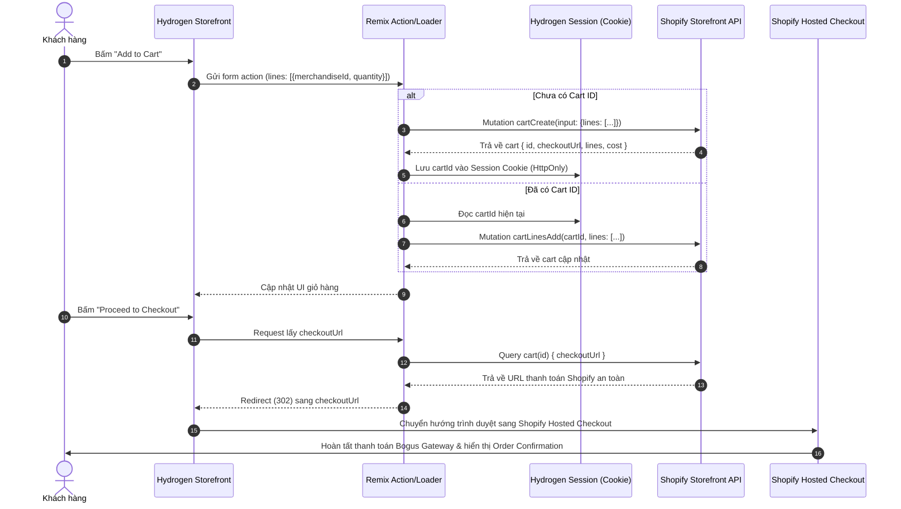

# ADR-007: Kiến Trúc Quản Lý Giỏ Hàng Headless Cart & Chuyển Hướng Shopify Checkout

> **Trạng thái:** ACCEPTED  
> **Ngày quyết định:** 2026-09-18  
> **Người quyết định:** Hà Đức Dương & Team Engineering  
> **Phân hệ áp dụng:** `Week13-14` (Phase 2 — Custom Hydrogen Headless Storefront)  

---

## 1. Bối Cảnh (Context)

Trong kiến trúc Headless Commerce, giao diện người dùng (Storefront) và hệ thống xử lý thanh toán (Checkout & Payment Gateway) được tách biệt hoàn toàn:
1. Giao diện Hydrogen chịu trách nhiệm cung cấp trải nghiệm duyệt sản phẩm, chọn biến thể, thêm vào giỏ hàng, cập nhật số lượng và hiển thị tổng tiền.
2. Nền tảng Shopify chịu trách nhiệm bảo mật thông tin thanh toán, tính toán thuế tự động, áp dụng phí vận chuyển và đạt chứng chỉ bảo mật tài chính quốc tế **PCI-DSS Level 1**.

Vấn đề đặt ra: Làm thế nào để quản lý trạng thái giỏ hàng xuyên suốt phiên làm việc của người dùng trên Hydrogen và chuyển tiếp mượt mà sang trang thanh toán chính thức của Shopify mà không làm mất sản phẩm hay sai lệch giá?

---

## 2. Quyết Định Kiến Trúc (Decision)

Chúng tôi quyết định áp dụng mô hình **Shopify Storefront Cart API kết hợp Web Checkout Redirect**:

1. **Vòng Đời Phiên Giỏ Hàng (Cart Session Lifecycle):**
   - Giỏ hàng được định danh bằng một chuỗi **`cartId`** duy nhất (định dạng GraphQL ID, ví dụ: `gid://shopify/Cart/c1-xxxx`).
   - `cartId` được lưu trong **Session Cookie** (`cartId`) phía server-side thông qua cơ chế session của Hydrogen (`HydrogenSession`).
   - Cookie có cờ bảo mật: `HttpOnly`, `SameSite=Lax`, `Path=/`, thời hạn lưu trữ 14 ngày.
2. **Bộ 4 Mutations Giỏ Hàng Nguyên Tử:**
   - **Tạo mới:** `cartCreate(input: { lines: [...] })` khi chưa có session.
   - **Thêm sản phẩm:** `cartLinesAdd(cartId: $cartId, lines: $lines)` khi đã có giỏ hàng.
   - **Cập nhật số lượng:** `cartLinesUpdate(cartId: $cartId, lines: $lines)` khi người dùng tăng/giảm số lượng trong trang Cart.
   - **Xóa sản phẩm:** `cartLinesRemove(cartId: $cartId, lineIds: $lineIds)` khi người dùng xóa mục hàng.
3. **Chuyển Hướng Thanh Toán (Web Checkout Redirect):**
   - Mọi đối tượng `Cart` trả về từ Storefront API đều sở hữu trường `checkoutUrl`.
   - Thuộc tính `checkoutUrl` đã bao gồm toàn bộ thông tin mã hóa về các dòng sản phẩm, mã giảm giá, và thông tin thị trường (tiền tệ VND hoặc USD).
   - Khi người dùng bấm nút "Proceed to Checkout", Hydrogen thực hiện chuyển hướng trình duyệt (HTTP 302 hoặc window redirect) trực tiếp sang `checkoutUrl`. Khách hàng hoàn tất thanh toán trên hạ tầng bảo mật cấp cao của Shopify, sau đó nhận email xác nhận đơn hàng chuẩn.

---

## 3. Hệ Quả & Đánh Đổi (Consequences)

### Tích cực (Positive):
- **Bảo mật tuyệt đối:** Không lưu trữ thông tin thẻ tín dụng hay dữ liệu nhạy cảm trên máy chủ Hydrogen, đạt chuẩn tuân thủ PCI-DSS tự động.
- **Tính bền vững:** Giỏ hàng tồn tại liên tục ngay cả khi người dùng tải lại trang, tắt trình duyệt hoặc đổi tab (nhờ session cookie).
- **Hỗ trợ đầy đủ tính năng:** Giảm giá tự động, tính thuế chính xác theo địa chỉ giao hàng, phương thức vận chuyển và cổng thanh toán thử nghiệm (Bogus Gateway) đều được Shopify xử lý chuẩn chỉ.

### Đánh đổi (Trade-offs):
- Có sự chuyển đổi domain (Cross-domain navigation) giữa Storefront (ví dụ: `localhost:3000` hoặc domain headless) sang `limiphotography.myshopify.com/checkouts/...`.
- Cần đảm bảo đồng bộ tiền tệ giữa Storefront và Checkout thông qua `@inContext(country, language)`.
