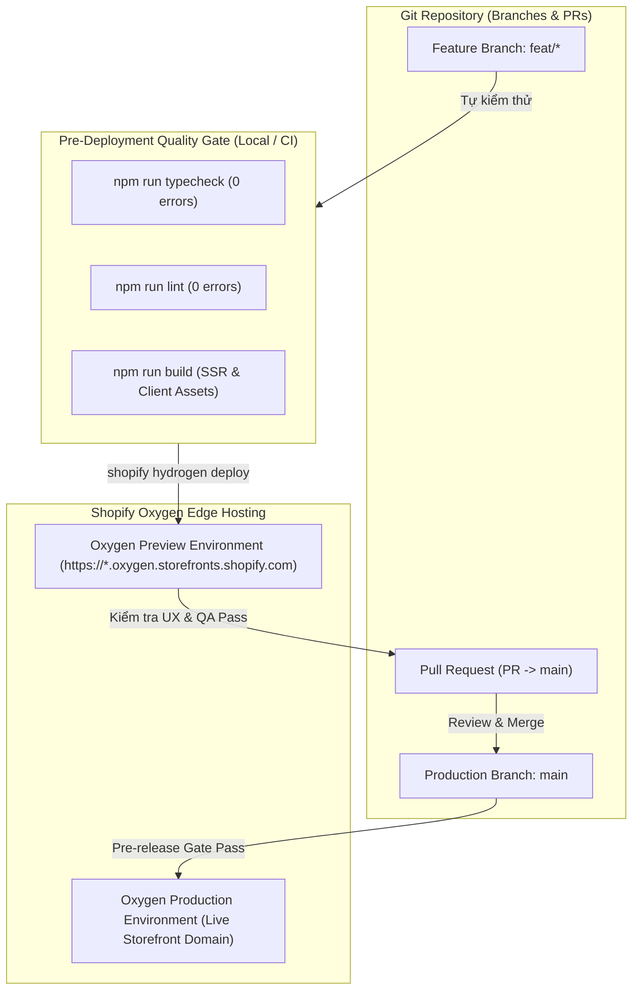

# ADR-008: Chiến Lược Triển Khai Kiểm Soát Trên Shopify Oxygen Edge Hosting & Quy Trình Gitflow CI/CD

> **Trạng thái:** ACCEPTED  
> **Ngày quyết định:** 2026-09-18  
> **Người quyết định:** Hà Đức Dương & Team Engineering  
> **Phân hệ áp dụng:** `Week13-14/limi-daily-pho-tography` (Phase 2 — Custom Hydrogen Headless Storefront)  

---

## 1. Bối Cảnh (Context)

Sau khi khởi tạo và xây dựng mã nguồn Hydrogen tại `Week13-14/limi-daily-pho-tography`, ứng dụng cần được triển khai lên hạ tầng máy chủ phân tán toàn cầu để phục vụ người dùng thực tế.

Nền tảng chính thức của Shopify dành cho Hydrogen là **Shopify Oxygen**:
- Môi trường chạy biên (Global Edge Worker Runtime dựa trên V8 isolate tương tự Cloudflare Workers).
- Tích hợp trực tiếp với Shopify Admin, hỗ trợ Zero-Downtime Instant Rollback và Custom Domains.
- Quản lý 2 loại môi trường: **Production** (tên miền chính thức của cửa hàng) và **Preview** (tên miền phụ tạm thời cho từng commit/nhánh tính năng).

Tuy nhiên, nếu không có quy trình kiểm soát chặt chẽ kết hợp với Gitflow, việc triển khai sẽ gặp phải các rủi ro nghiêm trọng:
1. **Deploy bừa bãi (Uncontrolled Deployments):** Triển khai trực tiếp mã nguồn chưa được kiểm thử hoặc còn lỗi TypeScript lên môi trường Production làm sập giao diện người dùng.
2. **Rò rỉ bí mật (Secret Leaks):** Đưa nhầm tệp `.env` cục bộ chứa Private Token lên Git hoặc cấu hình sai biến môi trường trên Oxygen.
3. **Mất dấu vết phiên bản (Traceability Loss):** Không rõ bản triển khai trên Oxygen tương ứng với commit hash nào trên Git.

---

## 2. Quyết Định Kiến Trúc (Decision)

Chúng tôi quyết định chuẩn hóa **Chiến Lược Triển Khai Kiểm Soát & Ma Trận Gitflow - Oxygen (Controlled Edge Deployment Strategy)**:



### 2.1. Phân Tầng Môi Trường Triển Khai (Environment Tiering)
1. **Môi trường Preview (Tạm thời & Kiểm thử tính năng):**
   - **Nguồn nhánh:** Bất kỳ nhánh `feat/*`, `fix/*` hoặc trước khi tạo PR.
   - **Lệnh thực thi:**
     ```bash
     cd Week13-14/limi-daily-pho-tography
     npm run build && npx shopify hydrogen deploy
     ```
   - **Đặc điểm:** Sinh ra URL Preview riêng biệt (ví dụ: `https://limidaily-pho-tography-preview-xxx.oxygen.storefronts.shopify.com`). Dùng để QA kiểm thử giao diện và chia sẻ cho Stakeholders review mà không làm gián đoạn người dùng thật.
2. **Môi trường Production (Chính thức & Công khai):**
   - **Nguồn nhánh:** **Duy nhất nhánh `main`**.
   - **Điều kiện tiên quyết:** Phải đạt 100% Quality Gates (QG-6 $\to$ QG-10), toàn bộ commit tuân thủ Conventional Commits.
   - **Lệnh thực thi:**
     ```bash
     cd Week13-14/limi-daily-pho-tography
     npm run build && npx shopify hydrogen deploy --production
     ```
   - **Đặc điểm:** Trỏ trực tiếp về domain bán hàng chính thức của cửa hàng.

### 2.2. Phân Định & Bảo Mật Biến Môi Trường (Environment Secrets Management)
- **Cấm tuyệt đối:** Không bao giờ đưa tệp `.env` hoặc các private credentials (`PRIVATE_STOREFRONT_API_TOKEN`, `SESSION_SECRET`) vào Git commit. Tệp `.env` đã được chặn trong `.gitignore`.
- **Cấu hình trên Oxygen:** Toàn bộ biến môi trường của môi trường Production và Preview được cấu hình trực tiếp trên giao diện Shopify Admin:
  `Shopify Admin > Settings > Apps and sales channels > Hydrogen > LimiDaily Pho tography > Environments > Environment variables`.
- Phân định rõ ràng:
  - `PUBLIC_*`: Các biến công khai, có thể đọc ở client (Domain, Public Storefront Token).
  - `PRIVATE_*` & `SESSION_SECRET`: Các biến bí mật chỉ nạp vào bộ nhớ của Edge Worker, tuyệt đối không lộ ra trình duyệt.

### 2.3. Rào Chắn Kiểm Định Trước Khi Triển Khai (Pre-Deployment Gates)
Không một bản build nào được phép triển khai lên Oxygen nếu chưa vượt qua bộ 3 lệnh kiểm định cục bộ:
```bash
npm run typecheck    # 1. TypeScript Strict (0 errors)
npm run lint         # 2. ESLint Rules (0 errors)
npm run build        # 3. Build Production SSR bundle thành công
```

---

## 3. Hệ Quả & Đánh Đổi (Consequences)

### Tích cực (Positive):
- **Bảo vệ tính sẵn sàng cao (High Availability):** Không bao giờ đưa code lỗi lên Production nhờ rào chắn Preview Deployment và Pre-deployment Gates.
- **Traceability Minh Bạch:** Mỗi deployment trên Oxygen liên kết chính xác với Storefront ID `gid://shopify/HydrogenStorefront/1000180215` và Git commit SHA tương ứng.
- **Zero-Downtime Rollback:** Nếu phát sinh sự cố sau khi deploy Production, kỹ sư có thể kích hoạt rollback về bản build trước đó chỉ bằng 1 cú click trên Shopify Admin Dashboard mà không cần build lại code.

### Đánh đổi (Trade-offs):
- Kỹ sư phải tuân thủ nghiêm ngặt quy trình kiểm tra build trước khi chạy lệnh deploy; không được deploy "tắt" (skip build).
