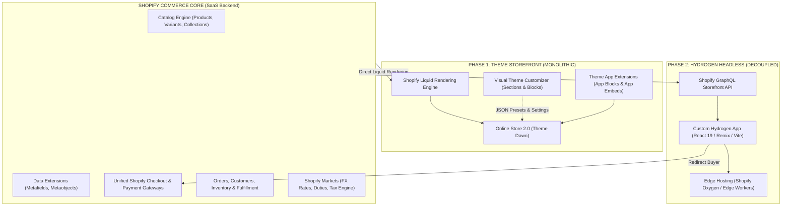
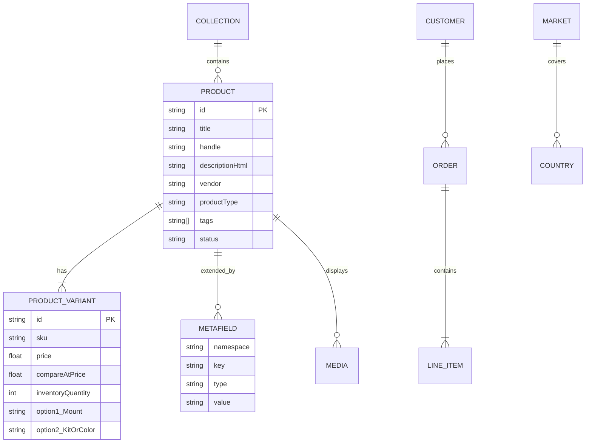
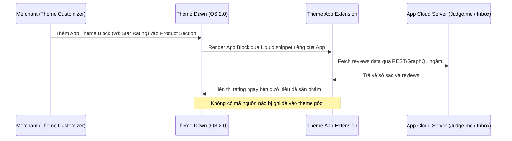

# KIẾN TRÚC HỆ THỐNG: SHOPIFY COMMERCE & HEADLESS STOREFRONT

> **Tài liệu:** Canonical Architecture Specification & Data Flow SSOT  
> **Workspace:** `Week13-14`  
> **Áp dụng cho:** Nửa đầu (Phase 1: Shopify Theme Storefront) & Nửa sau (Phase 2: Hydrogen Headless)  
> **Thang cấp thẩm quyền:** `docs/architecture.md` > `docs/product/store-specs.md` > `docs/adr/` > `README.md`  

---

## 1. Tổng Quan Kiến Trúc Hệ Sinh Thái Shopify

Hệ sinh thái Shopify cung cấp một nền tảng thương mại điện tử đa kênh (Omnichannel Commerce Engine) có thể tiếp cận theo hai mô hình kiến trúc chính: **Nguyên khối (Monolithic Theme Storefront)** và **Tách rời (Decoupled / Headless Storefront)**.



---

## 2. Phân Tích So Sánh Hai Mô Hình Kiến Trúc

### 2.1. Shopify Theme Storefront (Online Store 2.0 — Trọng tâm Phase 1)
- **Cơ chế hoạt động:** Mã nguồn theme được viết bằng ngôn ngữ mẫu **Liquid** kết hợp HTML/CSS và Web Components. Khi người mua truy cập, máy chủ Shopify biên dịch mã Liquid, nạp dữ liệu từ database và render mã HTML hoàn chỉnh trả về trình duyệt.
- **Cấu trúc Online Store 2.0 (OS 2.0):**
  - **JSON Templates:** Mọi trang (`index.json`, `product.json`, `collection.json`) đều là các tệp JSON khai báo danh sách Sections và Blocks cùng cấu hình presets.
  - **Sections & Blocks:** Các khối giao diện mô-đun hóa, cho phép merchant tùy ý thêm, bớt, sắp xếp lại vị trí trên Theme Customizer mà không cần lập trình viên can thiệp.
  - **Dynamic Sources:** Cơ chế liên kết trực tiếp các trường nhập liệu của Block tới **Metafields** hoặc thuộc tính sản phẩm.
- **Ưu điểm:** Triển khai thần tốc, chi phí thấp, tối ưu sẵn cho merchant tự quản lý giao diện, tận dụng toàn bộ mạng lưới CDN toàn cầu của Shopify.
- **Hạn chế:** Logic UI bị bó hẹp trong khả năng của Liquid; khi cài đặt quá nhiều app bên thứ ba có thể gây phình to tài nguyên JavaScript (bloatware) làm giảm điểm Core Web Vitals.

### 2.2. Hydrogen Headless Storefront (Trọng tâm Phase 2 — Active Implementation)
- **Cơ chế hoạt động:** Frontend hoàn toàn độc lập, xây dựng bằng **React 19** và **Remix** (React Router framework mode), chạy trên môi trường máy chủ biên (Edge runtime như Shopify Oxygen hoặc Node runtime).
- **Giao tiếp dữ liệu:** Frontend kết nối với Shopify Commerce Core độc quyền thông qua **GraphQL Storefront API** với Storefront Access Token.
- **Tài liệu quyết định kiến trúc:** Tham chiếu trực tiếp [ADR-005](adr/005-hydrogen-headless-remix-architecture.md), [ADR-006](adr/006-graphql-storefront-api-data-fetching.md), và [ADR-007](adr/007-headless-cart-and-checkout-strategy.md).
- **Ưu điểm:** 
  - Tự do sáng tạo trải nghiệm người dùng không giới hạn (giao diện tách rời, linh hoạt, khả năng mở rộng đa kênh).
  - Tối ưu hóa hiệu năng tối đa với kỹ thuật Streaming SSR, Suspense và Sub-request Caching (`CacheShort`, `CacheLong`).
  - Hệ thống component hiện đại với React, TypeScript Strict và Tailwind CSS.
- **Hạn chế & Nguyên tắc tuần này:** Cần quản trị tốt luồng dữ liệu giữa Server (`loader`/`action`) và Client. **Quy tắc vàng tuần này:** Giữ markup đơn giản, không dành thời gian cho CSS phức tạp; tập trung 100% vào routing, loaders, Shopify GraphQL data, cart state machine và checkout flow.

---

## 3. Mô Hình Hóa Dữ Liệu & Khả Năng Mở Rộng (Data Modeling)



### 3.1. Phân Tầng Dữ Liệu Sản Phẩm (Product Hierarchy)
1. **Product Level:** Chứa thông tin chung độc lập với biến thể: Tiêu đề, Mô tả giàu định dạng (HTML), Vendor (Nhà sản xuất/Thương hiệu quang học), Product Type, Tags (dùng để lọc và phân loại), và Thư viện Media (ảnh, video).
2. **Variant Level:** Đại diện cho sản phẩm cụ thể mà khách hàng mua:
   - Tối đa 3 Option Dimensions (ví dụ: `Mount`, `Kit Option`, `Color`).
   - Giới hạn 100 Variants cho mỗi sản phẩm tiêu chuẩn.
   - Mỗi Variant sở hữu: Giá bán lẻ (`Price`), Giá niêm yết so sánh (`Compare-at price`), Mã định danh kho hàng (`SKU`), Barcode (UPC/GTIN), Trọng lượng phục vụ tính cước, và Ảnh đại diện riêng.
3. **Inventory Policy:**
   - Theo dõi số lượng tồn kho tự động theo địa điểm kho hàng (`Locations`).
   - Thiết lập hành vi khi hết hàng: Chặn mua (`Deny`) hoặc Cho phép tiếp tục bán (`Continue selling when out of stock`).

### 3.2. Mở Rộng Schema Dữ Liệu Bằng Metafields & Metaobjects
Shopify cho phép mở rộng lược đồ dữ liệu nguyên bản bằng Metafields & Metaobjects:
- **Metafield Definitions:** Định nghĩa kiểu dữ liệu nghiêm ngặt cấp Store:
  - `custom.technical_specifications` (`multi_line_text_field`): Thông số cảm biến, ngàm, dải tần, công suất.
  - `custom.package_contents` (`multi_line_text_field`): Danh sách phụ kiện đóng gói trong hộp (In The Box).
  - `custom.compatibility` (`single_line_text_field`): Hệ sinh thái thiết bị và ngàm tương thích.
- **Metaobjects:** Định nghĩa thực thể dữ liệu thực thể nhiều trường (ví dụ: `gear_warranty_plan` - Gói bảo hành chuyên dụng).
- **Kết nối Dynamic Source:** Trên Theme Customizer, thay vì nhập text tĩnh, merchant bấm vào biểu tượng "Dynamic source" để liên kết trường của Theme Block tới Metafield tương ứng của sản phẩm đang xem.

---

## 4. Kiến Trúc Vận Hành Quốc Tế: Shopify Markets

Shopify Markets là trung tâm điều phối thương mại xuyên biên giới:
1. **Primary Market (Thị trường nội địa - Vietnam):**
   - Tiền tệ cơ sở: `VND`.
   - Ngôn ngữ mặc định: Tiếng Việt.
   - Giá hiển thị: Đã bao gồm thuế giá trị gia tăng (Tax inclusive).
2. **International Market (Thị trường quốc tế - United States & Global):**
   - Tiền tệ thanh toán: `USD`.
   - Tỉ giá chuyển đổi tự động (FX Rate) hoặc tỉ giá cố định do merchant thiết lập.
   - Làm tròn giá tự động (Rounding rules, ví dụ: làm tròn về `.99`).
   - Phân vùng địa lý giao hàng (Shipping Zones) với bảng cước vận chuyển riêng biệt.

---

## 5. Kiến Trúc Tích Hợp Ứng Dụng (App Extensibility)

Shopify cung cấp cơ chế **Theme App Extensions** để ứng dụng có thể hiển thị trên giao diện người dùng một cách sạch sẽ, không gây ô nhiễm mã nguồn theme:



- **App Theme Blocks:** Được đóng gói thành tệp `.liquid` độc lập trong thư mục extension của app. Merchant có thể thêm, xóa, kéo thả vị trí trong Section bất kỳ. Khi gỡ app, block tự động biến mất 100%.
- **App Embeds:** Dành cho các widget hoặc script toàn cục (ví dụ: Chat bubble của Shopify Inbox, form đăng ký Klaviyo). Chạy độc lập mà không can thiệp vào `layout/theme.liquid`. Bật/tắt an toàn chỉ qua 1 công tắc (toggle switch).

---

## 6. Kiến Trúc Chuyên Sâu Hydrogen Headless Storefront (Phase 2)

```mermaid
flowchart TD
    subgraph ClientBrowser["Client (Browser)"]
        UI["React Component UI (Lightweight Markup)"]
        CartDrawer["Cart Drawer / Cart View"]
        FormAction["Remix Form / fetcher.submit()"]
    end

    subgraph HydrogenEdge["Hydrogen Server (Remix Runtime)"]
        Router["Remix Nested Routing Engine"]
        Loader["route loader() (Server-Side GraphQL Fetch)"]
        Action["route action() (Cart Mutations)"]
        Session["Session Storage (Encrypted Cookie cartId)"]
        SFClient["Storefront API Client (Sub-request Cache)"]
    end

    subgraph ShopifyCloud["Shopify Core Platform"]
        SFAPI["Shopify GraphQL Storefront API"]
        HostedCheckout["Shopify Hosted Web Checkout (PCI-DSS)"]
    end

    UI -->|Navigate / URL Request| Router
    Router --> Loader
    Loader -->|storefront.query()| SFClient
    SFClient -->|HTTPS POST GraphQL| SFAPI
    SFAPI -->|JSON Data| SFClient
    SFClient -->|Render HTML + Hydration Data| UI

    CartDrawer -->|Add/Update/Remove| FormAction
    FormAction --> Action
    Action <-->|Read / Write cartId| Session
    Action -->|cartLinesAdd / cartLinesUpdate| SFClient
    Action -->|Return updated cart| UI

    CartDrawer -->|Click Checkout| Action
    Action -->|Retrieve checkoutUrl| HostedCheckout
    UI -->|302 Redirect| HostedCheckout
```

### 6.1. Luồng Dữ Liệu Server-First (Remix Loaders & Actions)
1. **Server-Side Data Fetching (`loader`):**
   - Toàn bộ việc kết nối với Shopify Storefront API được đóng gói hoàn toàn trong `loader` function phía server.
   - Trình duyệt không bao giờ giao tiếp trực tiếp với Shopify Storefront API, ngăn chặn nguy cơ rò rỉ token truy cập hoặc vi phạm CORS.
   - Tích hợp chuẩn **TypeScript Typing**: Các kiểu dữ liệu trả về từ GraphQL query được liên kết chặt chẽ với props của React Component.
2. **Data Mutation (`action`):**
   - Mọi thao tác tương tác người dùng làm biến đổi trạng thái (Thêm vào giỏ hàng, cập nhật số lượng, xóa sản phẩm) đều được gửi dưới dạng POST form action tới Remix `action`.
   - `action` nhận request, giải mã payload, gọi GraphQL Cart mutation tương ứng, cập nhật `cartId` vào encrypted session cookie và trả về kết quả cho component mà không cần reload trang.

### 6.2. Chiến Lược Bộ Nhớ Đệm Phụ (Sub-Request Caching)
Hydrogen cung cấp cơ chế kiểm soát cache chi tiết theo từng query:
- `CacheShort()`: Dành cho dữ liệu sản phẩm, số lượng tồn kho và giá (thời gian cache ngắn, tự động revalidate).
- `CacheLong()`: Dành cho thông tin cửa hàng (`shop`), danh sách menu điều hướng, nội dung bài viết blog và trang chính sách (dữ liệu ít biến động).
- `CacheNone()`: Dành riêng cho các truy vấn giỏ hàng (`cart`), dữ liệu người dùng cá nhân để tránh hiển thị sai lệch giữa các khách hàng.

### 6.3. Kiến Trúc 5 Routes Cốt Lõi (Core Routes Architecture)
Hệ thống được thiết kế theo cấu trúc định tuyến phẳng của Remix / Hydrogen:
1. **`app/routes/_index.tsx` (Homepage):**
   - `loader`: Query `shop` (tên, mô tả), bộ sưu tập nổi bật (*Cameras & Optics*), và 4 sản phẩm mới nhất.
   - Component: Render hero banner tối giản, danh sách category cards và featured product grid.
2. **`app/routes/collections.$handle.tsx` (Collection Page):**
   - `loader`: Nhận `$handle` từ URL param, query thông tin collection, danh sách products kèm cursor pagination (`first: 10`, `after: $cursor`).
   - Component: Render tiêu đề collection, bộ lọc cơ bản và lưới sản phẩm kèm nút chuyển trang (Next / Prev cursor).
3. **`app/routes/products.$handle.tsx` (Product Detail Page):**
   - `loader`: Nhận `$handle`, query thông tin chi tiết sản phẩm, danh sách variants, selected options, availability, và 3 Metafields (`technical_specifications`, `package_contents`, `compatibility`).
   - Component: Variant selector trực quan (Mount, Kit Option, Color), hiển thị giá theo biến thể được chọn, bảng thông số kỹ thuật (từ Metafield) và form "Add to Cart".
4. **`app/routes/cart.tsx` (Cart Page / Flow):**
   - `loader`: Đọc `cartId` từ session, query chi tiết giỏ hàng (`lines`, `cost`, `checkoutUrl`).
   - `action`: Xử lý 4 hành động: `ADD`, `UPDATE`, `REMOVE`, `CHECKOUT`.
   - Component: Bảng tóm tắt đơn hàng, bộ điều khiển số lượng (+ / -), nút xóa, tính tổng tạm tính và nút "Proceed to Checkout" dẫn sang `checkoutUrl`.
5. **`app/routes/blogs.$blogHandle.$articleHandle.tsx` (Blog Article Page):**
   - `loader`: Query bài viết theo blog handle (`news`) và article handle, trích xuất tiêu đề, tác giả, ngày đăng, ảnh đại diện và nội dung HTML.
   - Component: Giao diện đọc bài viết chuẩn SEO, hiển thị nội dung bài viết rõ ràng, dễ đọc.

---

## 7. Nguyên Tắc Thiết Kế Giao Diện Tối Giản (Zero CSS Bloat Strategy)

Theo yêu cầu chuẩn hóa của chương trình đào tạo Weaverse:
> *Trong tuần này, không cần dành thời gian cho CSS đẹp. Mục tiêu là hiểu Hydrogen routing, loaders, Shopify data, GraphQL, cart, và checkout flow. Markup đơn giản, dễ đọc là đủ. Phần styling polish sẽ làm ở final project.*

1. **HTML Ngữ Nghĩa (Semantic HTML):** Sử dụng các thẻ chuẩn `<header>`, `<nav>`, `<main>`, `<section>`, `<article>`, `<table>`, `<form>`, `<button>`.
2. **Layout Cơ Bản (Grid / Flexbox):** Tận dụng các utility class tối giản của Tailwind CSS (`container mx-auto`, `grid grid-cols-1 md:grid-cols-3 gap-6`, `flex justify-between items-center`, `border rounded p-4`).
3. **Tránh Thư Viện Nặng:** Tuyệt đối không cài đặt Tailwind UI, Shadcn/UI, Chakra, Material-UI, Framer Motion hay bất kỳ animation library nào trong Phase 2 để giữ môi trường phát triển tinh gọn, tốc độ build dưới 3 giây và tập trung 100% vào logic nghiệp vụ e-commerce.

