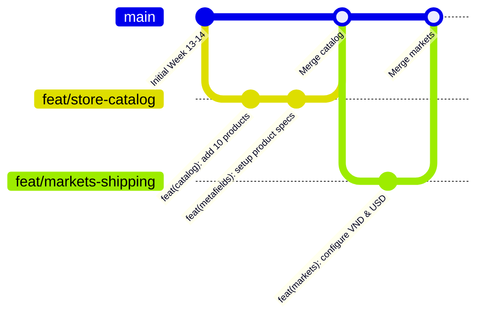

# QUY TRÌNH GITFLOW & TIÊU CHUẨN MÃ NGUỒN (GIT WORKFLOW)

> **Tài liệu:** Canonical Git Workflow & Version Control Specification SSOT  
> **Workspace:** `Week13-14`  

---

## 1. Chiến Lược Nhánh Làm Việc (Branching Strategy)

Toàn bộ quá trình phát triển phân hệ **Week 13-14** tuân thủ mô hình phân nhánh Gitflow chuẩn:



1. **Nhánh `main`:**
   - Nhánh phản ánh mã nguồn và cấu hình chính thức, đã vượt qua toàn bộ Quality Gates.
   - Không thực hiện commit trực tiếp các tính năng dở dang lên nhánh `main`.
2. **Nhánh tính năng `feat/<kebab-case-name>`:**
   - Tạo ra từ `main` để thực hiện một cụm tính năng hoặc tài liệu (ví dụ: `feat/store-specs-and-metafields`, `feat/theme-dawn-customization`).
3. **Nhánh sửa lỗi `fix/<kebab-case-name>`:**
   - Dùng để sửa chữa nhanh các lỗi cấu hình, sai lệch trường metafield hoặc xung đột theme (ví dụ: `fix/search-filter-metafield`, `fix/currency-rounding`).

---

## 2. Tiêu Chuẩn Thông Điệp Commit (Conventional Commits)

Mọi commit bắt buộc phải viết bằng **Tiếng Anh**, tuân thủ nghiêm ngặt định dạng:
```text
<type>(<scope>): <short description in present tense>
```

### 2.1. Danh Sách Các Type Chuẩn
- `feat`: Thêm mới sản phẩm, cấu hình thị trường, tích hợp app mới, hoặc tạo trang mới.
- `fix`: Khắc phục lỗi hiển thị theme, sửa sai cú pháp liquid hoặc điều chỉnh giá/tỉ giá.
- `docs`: Thêm mới hoặc cập nhật tài liệu kỹ thuật, kiến trúc, ADRs, glossary.
- `style`: Định dạng mã nguồn, CSS/SCSS hoặc chỉnh sửa layout thẩm mỹ mà không đổi logic.
- `refactor`: Tái cấu trúc cấu hình template JSON hoặc gom nhóm tags/metafields.
- `chore`: Cập nhật cấu hình công cụ, script CLI hoặc dependencies.

### 2.2. Danh Sách Các Scope Chuẩn Phân Hệ Week 13-14
- `catalog`: Dữ liệu 10 sản phẩm, biến thể, tags, collections.
- `metafields`: Định nghĩa và cấu hình dữ liệu custom metafields / metaobjects.
- `markets`: Cấu hình Shopify Markets, tỉ giá đa tiền tệ, làm tròn giá.
- `shipping`: Cấu hình shipping profiles, phí vận chuyển và vùng giao hàng.
- `payments`: Cấu hình Bogus gateway, test payments, COD, bank transfer.
- `apps`: Cài đặt và cấu hình 5 Shopify apps, App Embeds, Theme App Extensions.
- `theme`: Tùy biến Theme Dawn, header, footer, announcement bar, typography, colors.
- `pages`: Tạo các trang tĩnh (*About Us*, *Contact*, *Policies*) và templates.
- `e2e`: Kịch bản kiểm thử luồng khách hàng từ duyệt sản phẩm đến thanh toán.
- `docs`: Các tệp tài liệu trong `docs/`, `AGENTS.md`, `README.md`.
- *(Phase 2)* `hydrogen`: Khởi tạo app, cấu hình Vite, Hydrogen runtime và biến môi trường `.env`.
- *(Phase 2)* `graphql`: Bộ 7 bài tập truy vấn GraphQL Storefront API và colocated queries.
- *(Phase 2)* `routes`: Xây dựng 5 routes cốt lõi (Homepage, Collection, Product, Cart, Blog).
- *(Phase 2)* `cart`: Xử lý giỏ hàng Headless, mutations `cartCreate`/`cartLinesAdd`, session cookie.
- *(Phase 2)* `checkout`: Web checkout redirect flow và chuyển hướng thanh toán an toàn.
- *(Phase 2)* `deploy`: Cấu hình và triển khai ứng dụng lên máy chủ biên Shopify Oxygen (Preview / Production).

---

## 3. Nguyên Tắc Nguyên Tử Hóa Commit (One Concern = One Commit)

- **Không gộp chung:** Tuyệt đối không gộp việc thêm sản phẩm với việc cấu hình app hoặc viết tài liệu vào cùng một commit.
- **Tách bạch rõ ràng:**
  - Ví dụ commit tốt (Phase 1):
    - `feat(catalog): create 10 products with mount and kit variants across 3 collections`
    - `feat(metafields): establish technical specs and package contents definitions`
    - `feat(markets): enable domestic vnd and international usd markets with auto rounding`
    - `feat(apps): integrate search discovery filters and judge.me review blocks`
    - `feat(theme): customize dawn homepage hero banner, collection grid, and brand typography`
  - Ví dụ commit tốt (Phase 2):
    - `feat(hydrogen): scaffold hydrogen app with typescript and tailwind css`
    - `feat(graphql): implement store info and products with variants storefront queries`
    - `feat(routes): build collection and product detail routes with variant pickers`
    - `feat(cart): implement headless cart mutations and session cookie persistence`
    - `feat(checkout): handle secure web checkout redirect with bogus gateway testing`
    - `deploy(oxygen): deploy initial storefront build to oxygen preview environment`

---

## 4. Quy Trình Đồng Bộ & Kiểm Tra Trước Khi Push

```bash
# 1. Kéo mã nguồn mới nhất từ remote main với rebase
git checkout main
git pull --rebase origin main

# 2. Tạo nhánh làm việc
git checkout -b feat/<task-name>

# 3. Sau khi hoàn thành, kiểm tra thay đổi
git status
git diff

# 4. Stage và commit đúng các file liên quan
git add <cac_file_thay_doi>
git commit -m "<type>(<scope>): <mo_ta>"

# 5. Đẩy nhánh lên remote
git push origin feat/<task-name>
```

---

## 5. Quy Trình Triển Khai Kiểm Soát Lên Shopify Oxygen (Git-to-Deployment Lifecycle)

Mọi thao tác triển khai lên hạ tầng Shopify Oxygen đều phải bám sát trạng thái nhánh Git:

### 5.1. Ma Trận Điều Phối Nhánh & Môi Trường
- **Nhánh Tính Năng (`feat/*`, `fix/*`):**
  - Chỉ được phép triển khai lên **Preview Environment** qua lệnh:
    ```bash
    cd Week13-14/limi-daily-pho-tography
    npm run build && npx shopify hydrogen deploy
    ```
  - Cung cấp Preview URL cho team review giao diện và chức năng trước khi tạo Pull Request vào `main`.
- **Nhánh Chính Thức (`main`):**
  - Là nguồn duy nhất được phép triển khai lên **Production Environment**:
    ```bash
    cd Week13-14/limi-daily-pho-tography
    npm run build && npx shopify hydrogen deploy --production
    ```
  - Chỉ thực thi khi nhánh `main` đã merge và đạt 100% Quality Gates (QG-6 $\to$ QG-10).

### 5.2. Rào Chắn 3 Bước Bắt Buộc Trước Khi Triển Khai (Pre-Deployment Gate)
1. **Kiểm tra kiểu dữ liệu:** `npm run typecheck` (0 errors, không dùng `any`).
2. **Kiểm tra quy chuẩn mã nguồn:** `npm run lint` (0 errors).
3. **Kiểm tra khả năng đóng gói:** `npm run build` (tạo bundle SSR và Client thành công).
4. **Ghi nhận lịch sử:** Cập nhật URL, commit SHA và thời gian triển khai vào [.scratch/checkpoint.md](../.scratch/checkpoint.md).

