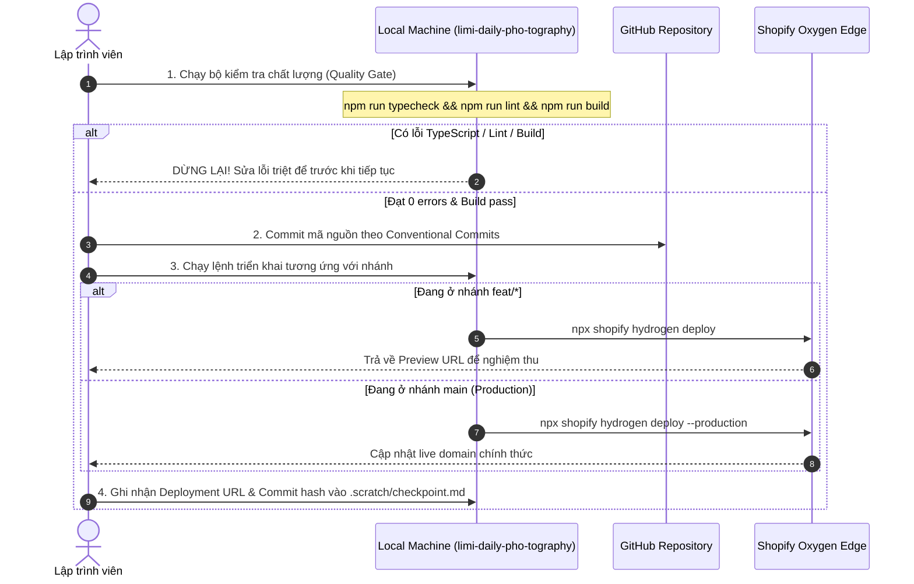

# HƯỚNG DẪN TRIỂN KHAI & KIỂM SOÁT VẬN HÀNH TRÊN SHOPIFY OXYGEN (OXYGEN DEPLOYMENT & CI/CD)

> **Tài liệu:** Canonical Deployment & Operational Runbook SSOT  
> **Workspace:** `Week13-14/limi-daily-pho-tography`  
> **Mục tiêu:** Chuẩn hóa quy trình kiểm soát triển khai ứng dụng Hydrogen lên nền tảng máy chủ biên Shopify Oxygen, đảm bảo tuân thủ tuyệt đối quy trình Gitflow và bảo vệ an toàn môi trường Production.  

---

## 1. Tổng Quan Hạ Tầng Máy Chủ Biên Shopify Oxygen

**Shopify Oxygen** là nền tảng máy chủ biên toàn cầu (Global Edge Worker Hosting) do Shopify xây dựng riêng cho framework Hydrogen:
- **Thời gian phản hồi siêu tốc (Sub-second TTFB):** Ứng dụng chạy trên mạng lưới máy chủ biên phủ khắp toàn cầu, nạp dữ liệu gần nhất với vị trí địa lý của người mua.
- **Tích hợp sâu:** Tự động đồng bộ hóa với Shopify Admin, GraphQL Storefront API, và các chính sách bảo mật mạng của Shopify.
- **Liên kết Storefront ID:** Dự án `limi-daily-pho-tography` đã được liên kết chính thức với:
  - **Storefront Title:** `LimiDaily Pho tography`
  - **Storefront ID:** `gid://shopify/HydrogenStorefront/1000180215`
  - **Cửa hàng đích:** `intern-ha-duc-duong-store.myshopify.com`

---

## 2. Ma Trận Ánh Xạ Gitflow $\leftrightarrow$ Môi Trường Oxygen (Environment Matrix)

Mọi hoạt động triển khai bắt buộc phải tuân theo quy tắc ánh xạ nhánh sau:

| Nhánh Git | Môi Trường Oxygen | Mục Đích Sử Dụng | Lệnh Triển Khai | Tiêu Chuẩn Nghiệm Thu |
| :--- | :--- | :--- | :--- | :--- |
| `feat/*`, `fix/*` | **Preview Environment** | Kiểm thử giao diện, review tính năng, kiểm thử API | `npx shopify hydrogen deploy` | Build pass, sinh ra Preview URL riêng biệt |
| `main` | **Production Environment** | Cửa hàng công khai chính thức, phục vụ khách hàng | `npx shopify hydrogen deploy --production` | Vượt qua 100% Quality Gates (QG-6 $\to$ QG-10) |

---

## 3. Quy Trình 4 Bước Triển Khai Có Kiểm Soát (Controlled Deployment Workflow)



### Bước 1: Rào Chắn Kiểm Định Trước Khi Deploy (Bắt buộc)
Tại thư mục `Week13-14/limi-daily-pho-tography`, chạy tuần tự bộ 3 lệnh kiểm tra:

```bash
# 1. Kiểm tra an toàn kiểu dữ liệu (TypeScript Strict)
npm run typecheck

# 2. Kiểm tra quy chuẩn cú pháp ESLint
npm run lint

# 3. Kiểm tra khả năng đóng gói Production bundle
npm run build
```

> [!CAUTION]
> Nếu bất kỳ lệnh nào báo lỗi (`exit code != 0`), **TUYỆT ĐỐI KHÔNG ĐƯỢC CHẠY LỆNH DEPLOY**. Phải sửa triệt để lỗi kiểu dữ liệu hoặc lỗi cú pháp trước.

### Bước 2: Triển Khai Môi Trường Preview (Kiểm Thử Tính Năng)
Khi bạn đang làm việc trên nhánh tính năng (ví dụ `feat/product-specs-metafield`) và muốn kiểm tra tính năng trên môi trường thật:

```bash
# Đảm bảo đã build bundle mới nhất
npm run build

# Triển khai lên Oxygen môi trường Preview
npx shopify hydrogen deploy
```
*Kết quả:* Terminal sẽ trả về một đường link Preview dạng:
`https://limidaily-pho-tography-preview-[hash].oxygen.storefronts.shopify.com`. Hãy truy cập link này trên trình duyệt để kiểm tra toàn diện.

### Bước 3: Triển Khai Môi Trường Production (Chính Thức)
Chỉ thực hiện khi tính năng đã hoàn thiện, đã được review và merge vào nhánh `main`:

```bash
# Chuyển về nhánh main và kéo mã nguồn mới nhất
git checkout main
git pull origin main

# Kiểm tra chất lượng và build
npm run build

# Triển khai chính thức lên Production
npx shopify hydrogen deploy --production
```

### Bước 4: Đồng Bộ Ghi Nhận Nhật Ký Triển Khai
Sau khi deploy thành công, cập nhật ngay thông tin vào [Week13-14/.scratch/checkpoint.md](file:///c:/Users/rivea/Documents/GitHub/intern-ha-duc-duong/Week13-14/.scratch/checkpoint.md):
- Thời gian triển khai.
- Commit hash tương ứng.
- Đường dẫn Preview URL hoặc Production URL.
- Trạng thái kiểm thử trên live URL.

---

## 4. Quản Trị Biến Môi Trường & Bí Mật Trên Oxygen (Secrets Management)

> [!WARNING]
> Tệp `.env` chỉ có hiệu lực khi chạy cục bộ với MiniOxygen (`npm run dev`). Khi deploy lên Oxygen, máy chủ biên sẽ đọc biến môi trường từ cấu hình trên **Shopify Admin Dashboard**.

### Danh Sách Biến Môi Trường Cần Thiết Trên Oxygen:
1. Đăng nhập vào Shopify Admin: `https://admin.shopify.com/store/intern-ha-duc-duong-store`.
2. Vào **Settings** $\to$ **Apps and sales channels** $\to$ chọn **Hydrogen**.
3. Chọn storefront **LimiDaily Pho tography** $\to$ Chuyển sang tab **Environments**.
4. Chọn môi trường cần cấu hình (**Production** hoặc **Preview**) $\to$ Vào mục **Environment variables**:

| Tên biến | Kiểu bảo mật | Giá trị ví dụ | Mục đích |
| :--- | :--- | :--- | :--- |
| `PUBLIC_STORE_DOMAIN` | Public | `intern-ha-duc-duong-store.myshopify.com` | Tên miền store phục vụ GraphQL client |
| `PUBLIC_STOREFRONT_API_TOKEN` | Public | `e35cd8c7a216d5927727fdda93f22957` | Token truy vấn Storefront API công khai |
| `PUBLIC_STOREFRONT_API_VERSION` | Public | `2025-01` | Phiên bản Storefront API ổn định |
| `SESSION_SECRET` | **Secret** (Mã hóa) | *Chuỗi bí mật 32+ ký tự* | Khóa mã hóa Cookie giỏ hàng của người dùng |
| `PRIVATE_STOREFRONT_API_TOKEN` | **Secret** (Mã hóa) | `your_private_token` | Token đặc quyền cho server-side queries |

---

## 5. Giám Sát, Nhật Ký Lỗi & Quy Trình Rollback Khẩn Cấp

### 5.1. Xem Deployment Logs Trực Quan
1. Truy cập Shopify Admin $\to$ **Hydrogen** $\to$ **LimiDaily Pho tography**.
2. Tab **Deployments** hiển thị toàn bộ lịch sử các lần deploy kèm theo:
   - Trạng thái: `Successful`, `Failed`, hoặc `Building`.
   - Commit message & Commit author.
   - Nút **View log** để xem chi tiết log của tiến trình build trên server.

### 5.2. Quy Trình Khôi Phục Khẩn Cấp (Instant Zero-Downtime Rollback)
Nếu một bản deploy Production phát sinh lỗi nghiêm trọng ngoài dự kiến (ví dụ lỗi checkout redirect hoặc lỗi query GraphQL):
1. Vào tab **Deployments** trên Shopify Admin.
2. Tìm bản deploy thành công gần nhất trước đó (Last Known Good Deployment).
3. Bấm vào biểu tượng menu ba chấm `...` bên cạnh bản ghi $\to$ Chọn **Redeploy to Production** (hoặc **Rollback**).
4. Hệ thống Oxygen sẽ chuyển luồng truy cập của người dùng về bản build cũ **trong vòng 5 giây mà không có bất kỳ thời gian gián đoạn (zero downtime)** nào.
5. Tạo nhánh `fix/<incident-name>` trên Git để tái hiện và khắc phục nguyên nhân gốc rễ.
