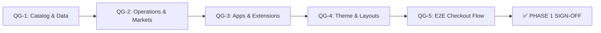
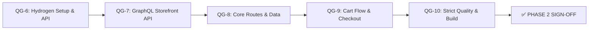

# CỔNG KIỂM ĐỊNH CHẤT LƯỢNG (QUALITY GATES) — PHASE 1

> **Tài liệu:** Canonical Quality Assurance & Verification Specification SSOT  
> **Workspace:** `Week13-14`  
> **Áp dụng cho:** Nửa đầu (Phase 1) — Shopify Development Store & Theme Customizer  

---

## 1. Tổng Quan Hệ Thống 5 Cổng Kiểm Định (QG-1 $\to$ QG-5)

Để đảm bảo cửa hàng trực tuyến đạt chuẩn chuyên nghiệp, sẵn sàng cho người dùng trải nghiệm thực tế và làm nền tảng vững chắc cho Phase 2 (Hydrogen Headless), toàn bộ 5 cổng kiểm định sau bắt buộc phải đạt trạng thái **100% PASS** trước khi nghiệm thu Phase 1:

---

## 2. Tiêu Chí Chi Tiết Từng Cổng Kiểm Định

### 🛡️ CỔNG 1 (QG-1): STORE DATA & CATALOG AUDIT
*Mục tiêu: Đảm bảo dữ liệu danh mục sản phẩm, biến thể, metafields và nội dung bài viết đạt chất lượng thương mại hoàn hảo.*

- [ ] **Sản phẩm:** Đủ tối thiểu 10 sản phẩm thiết bị quang học, máy quay, ánh sáng và phụ kiện studio thực tế, có tiêu đề chuẩn, phân loại Vendor, Type và Tags.
- [ ] **Hình ảnh Media:** Mỗi sản phẩm có từ 3–5 hình ảnh thiết bị chất lượng cao, sắc nét, có ảnh đại diện cho từng biến thể ngàm hoặc màu sắc.
- [ ] **Biến thể (Variants):** Các sản phẩm có đầy đủ Options (Mount: Sony E/Canon RF/Nikon Z; Kit: Standard/Pro Combo; Color: Stealth Black/Silver), SKU logic định danh, giá bán và giá Compare-at price.
- [ ] **Bộ sưu tập (Collections):** Đủ 3 bộ sưu tập (*Cameras & Optics*, *Lighting & Audio*, *Rigging & Accessories*) với ảnh bìa và mô tả thu hút.
- [ ] **Metafields & Metaobjects:** 3 định nghĩa Metafields (`custom.technical_specifications`, `custom.package_contents`, `custom.compatibility`) và Metaobject `gear_warranty_plan` đã được ghim (pinned) và điền đầy đủ dữ liệu thực tế cho cả 10 sản phẩm.
- [ ] **Bài viết Blog:** Đủ 3 bài viết chuyên môn trong blog "News" với tiêu đề chuẩn SEO, hình ảnh bìa, tác giả, tags và nội dung định dạng đẹp.
- [ ] **Trang tĩnh & Chính sách:** 5 trang đã xuất bản: *About Us*, *Contact Us* (kèm form liên hệ), *Warranty & Service Policy*, *Shipping & Transit Insurance Policy*, *Privacy Policy*.

---

### 🛡️ CỔNG 2 (QG-2): STORE OPERATIONS & MARKETS AUDIT
*Mục tiêu: Xác minh các thiết lập thị trường toàn cầu, tiền tệ, vận chuyển và thanh toán thử nghiệm.*

- [ ] **Shopify Markets:** Thiết lập tối thiểu 2 thị trường:
  - Thị trường nội địa: Vietnam (Tiền tệ: `VND`, Ngôn ngữ: Tiếng Việt).
  - Thị trường quốc tế: United States / International (Tiền tệ: `USD`, Ngôn ngữ: English).
- [ ] **Đa tiền tệ (Multi-currency):** Bộ chuyển đổi tiền tệ trên Header hoạt động chuẩn xác, tự động làm tròn giá (`.99` hoặc số nguyên).
- [ ] **Shipping Profiles:**
  - Vùng nội địa: Đơn vị vận chuyển tiêu chuẩn (30.000₫), Miễn phí vận chuyển cho đơn hàng từ 500.000₫ trở lên.
  - Vùng quốc tế: Flat-rate cước quốc tế ($15 USD).
- [ ] **Cổng thanh toán:**
  - Kích hoạt thành công **Bogus Gateway** (Test mode).
  - Cấu hình phương thức thanh toán thủ công: Cash on Delivery (COD) và Chuyển khoản ngân hàng.
- [ ] **Tài khoản khách hàng:** Bật tính năng Customer Accounts (New Customer Accounts hoặc Classic).

---

### 🛡️ CỔNG 3 (QG-3): APPS & THEME EXTENSIONS AUDIT
*Mục tiêu: Đảm bảo 5 ứng dụng Shopify cốt lõi được cài đặt và tích hợp mượt mà.*

- [ ] **Shopify Search & Discovery:**
  - Đã kích hoạt bộ lọc faceted filters (lọc theo Size, Color, Price, Availability, Metafield).
  - Đã cấu hình Product Recommendations (sản phẩm gợi ý liên quan).
- [ ] **Shopify Translate & Adapt:** Đã kích hoạt ngôn ngữ tiếng Anh và dịch tự động các nội dung chính cho thị trường quốc tế.
- [ ] **Shopify Inbox:** Bật App Embed live chat widget ở góc dưới bên phải màn hình, thiết lập lời chào tự động.
- [ ] **Judge.me Product Reviews:**
  - Khối App Theme Block "Star Rating" xuất hiện dưới tên sản phẩm trên Product Card và Product Details.
  - Widget viết đánh giá "Review Widget" xuất hiện ở cuối trang sản phẩm.
- [ ] **Klaviyo:** Cài đặt app, kết nối tài khoản và thiết lập form đăng ký nhận bản tin Newsletter.

---

### 🛡️ CỔNG 4 (QG-4): THEME CUSTOMIZER & DESIGN AUDIT
*Mục tiêu: Kiểm tra độ hoàn thiện thẩm mỹ và tính tương tác của giao diện Theme Dawn.*

- [ ] **Bản sắc thương hiệu:** Logo và Favicon sắc nét, bảng màu tương phản trang nhã, typography hiện đại đồng bộ.
- [ ] **Homepage:**
  - Announcement bar (Thông báo miễn phí vận chuyển).
  - Header (Menu điều hướng đa cấp, search modal, cart icon).
  - Hero Image Banner với tiêu đề ấn tượng và nút CTA "Shop Now".
  - Featured Collection grid (lưới sản phẩm nổi bật có hiển thị nhãn Sale).
  - Collection List (banner dẫn vào 3 bộ sưu tập chính).
  - Section Image with text / Brand Story.
  - Testimonials / Khách hàng đánh giá.
  - Newsletter Subscription section.
- [ ] **Collection Template:** Lưới hiển thị 3–4 cột responsive, bộ lọc dọc (Vertical filter) và dropdown sắp xếp hoạt động mượt mà.
- [ ] **Product Template:**
  - Media gallery có tính năng zoom/slider ảnh.
  - Variant picker dạng pills chuyển đổi ảnh và cập nhật giá tương ứng.
  - Buy buttons (Add to cart + Buy it now) hoạt động chuẩn.
  - Các khối Accordion (Collapsible rows) hiển thị dữ liệu động từ Metafields (`custom.technical_specifications`, `custom.package_contents`, `custom.compatibility`).
  - Khối Judge.me review widget hiển thị cân đối.
- [ ] **Footer:** Đầy đủ menu chính sách, quick links, form newsletter và biểu tượng mạng xã hội.

---

### 🛡️ CỔNG 5 (QG-5): END-TO-END CUSTOMER JOURNEY AUDIT
*Mục tiêu: Trực tiếp trải nghiệm và kiểm thử trọn vẹn hành trình khách hàng từ duyệt sản phẩm đến thanh toán đơn hàng.*

- [ ] **Luồng duyệt sản phẩm:**
  - Khách hàng vào Homepage $\to$ bấm vào Collection $\to$ dùng Filter chọn màu "Black" và size "L" $\to$ sản phẩm lọc ra chính xác.
- [ ] **Luồng giỏ hàng:**
  - Chọn sản phẩm $\to$ chọn biến thể $\to$ bấm "Add to Cart" $\to$ Giỏ hàng Drawer trượt ra mượt mà, hiển thị đúng ảnh, tên, biến thể và tổng tiền.
- [ ] **Luồng Checkout:**
  - Tại trang Checkout, điền thông tin địa chỉ giao hàng giả lập.
  - Chọn phương thức vận chuyển nội địa (thấy phí ship 30.000₫ hoặc 0₫ nếu đơn > 500k).
  - Chọn thanh toán bằng Bogus Gateway: Nhập thẻ số `1` (tháng/năm bất kỳ, CVV 3 số).
  - Bấm "Pay now" $\to$ Điều hướng thành công tới trang **Thank You / Order Confirmation**.
- [ ] **Xác minh phía Admin:**
  - Vào Shopify Admin $\to$ **Orders**: Đơn hàng mới xuất hiện ngay lập tức với trạng thái `Paid` và `Unfulfilled`.
  - Thử bấm **Fulfill item**, nhập mã tracking giả lập `VNPOST123456` $\to$ Trạng thái chuyển thành `Fulfilled`.
- [ ] **Kiểm tra chuyển đổi thị trường quốc tế:**
  - Đổi selector tiền tệ sang **USD** $\to$ Giá toàn bộ store hiển thị bằng `$ USD` và đã áp dụng làm tròn `.99`.

---

## 3. Hệ Thống 5 Cổng Kiểm Định Chất Lượng — Phase 2 (QG-6 $\to$ QG-10)

Áp dụng cho phân kỳ **Custom Hydrogen Headless Storefront**:

### 🛡️ CỔNG 6 (QG-6): HYDROGEN SETUP & STOREFRONT API CONNECTIVITY
*Mục tiêu: Đảm bảo app Hydrogen được khởi tạo chuẩn hóa, kết nối thành công với live store.*

- [ ] **Khởi tạo dự án:** Chạy lệnh `npm create @shopify/hydrogen@latest` thành công với TypeScript và Tailwind CSS.
- [ ] **Storefront API Scopes:** Ứng dụng custom app trong Shopify Admin đã được cấp quyền đọc catalog (`unauthenticated_read_product_listings`), đọc nội dung (`unauthenticated_read_content`) và ghi checkout (`unauthenticated_write_checkouts`).
- [ ] **Cấu hình môi trường (.env):** Đã thiết lập đầy đủ `SESSION_SECRET`, `PUBLIC_STORE_DOMAIN`, `PUBLIC_STOREFRONT_API_TOKEN`, và `PUBLIC_STOREFRONT_API_VERSION`.
- [ ] **Khởi chạy Local Dev:** Chạy `npm run dev` thành công tại `http://localhost:3000`, không gặp lỗi crash môi trường Edge runtime.

---

### 🛡️ CỔNG 7 (QG-7): GRAPHQL STOREFRONT API MASTERY
*Mục tiêu: Thành thạo cú pháp Storefront API và hoàn thành 100% 7 bài tập query trên Shopify GraphiQL App.*

- [ ] **Shopify GraphiQL App:** Đăng nhập thành công tại `shopify-graphiql-app.shopifycloud.com` với dev store.
- [ ] **Query 1 (Shop Info):** Query thành công tên shop, mô tả và cấu hình tiền tệ.
- [ ] **Query 2 (Products with Variants):** Lấy danh sách 10 sản phẩm đầu tiên kèm dải giá và biến thể.
- [ ] **Query 3 (Collection by Handle):** Lấy chi tiết collection và danh sách sản phẩm theo `$handle`.
- [ ] **Query 4 (Product Options & Availability):** Lấy đầy đủ options, biến thể và trạng thái `availableForSale`.
- [ ] **Query 5 (Blog Articles):** Lấy danh sách bài viết từ blog "News" kèm tác giả và ngày đăng.
- [ ] **Query 6 (Metafields):** Trích xuất chính xác 3 Custom Metafields (`technical_specifications`, `package_contents`, `compatibility`).
- [ ] **Query 7 (Cursor Pagination):** Thực thi phân trang với `first`, `after`, và kiểm tra `pageInfo.hasNextPage`.

---

### 🛡️ CỔNG 8 (QG-8): HYDROGEN CORE ROUTES & DATA BINDING
*Mục tiêu: 5 routes cốt lõi render dữ liệu thật từ Shopify Storefront API thông qua Remix Loaders.*

- [x] **Route 1: Homepage (`/`):** Hiển thị thông tin shop, hero banner, danh sách 3 collections và các sản phẩm nổi bật.
- [x] **Route 2: Collection Page (`/collections/:handle`):** Render danh mục sản phẩm theo collection handle, hỗ trợ phân trang cursor-based sang trang kế tiếp.
- [x] **Route 3: Product Page (`/products/:handle`):** Hiển thị thư viện ảnh, bộ chọn biến thể (Variant picker), cập nhật giá theo biến thể, hiển thị bảng 3 Metafields kỹ thuật và nút "Add to Cart".
- [x] **Route 4: Cart Page (`/cart`):** Hiển thị danh sách sản phẩm trong giỏ hàng và tổng chi phí.
- [x] **Route 5: Blog Page (`/blogs/:blogHandle/:articleHandle`):** Render bài viết chuyên môn với HTML an toàn, tác giả và ngày xuất bản.
- [x] **UI Tối Giản & Tactile:** Giao diện sử dụng semantic HTML sạch sẽ, cấu trúc rõ ràng, hỗ trợ Empty States và Error Boundaries hoàn chỉnh.

---

### 🛡️ CỔNG 9 (QG-9): HEADLESS CART FLOW & CHECKOUT REDIRECT
*Mục tiêu: Hoàn tất trọn vẹn luồng giỏ hàng và chuyển hướng thanh toán an toàn sang Shopify Checkout.*

- [x] **Add to Cart:** Bấm thêm sản phẩm kích hoạt Remix `action`, tạo hoặc cập nhật giỏ hàng qua mutation `cartCreate` hoặc `cartLinesAdd`.
- [x] **Session Persistence:** `cartId` được lưu trữ an toàn trong Session Cookie, giỏ hàng không bị mất khi reload trình duyệt.
- [x] **Update & Remove:** Tăng/giảm số lượng (`cartLinesUpdate`) hoặc xóa sản phẩm (`cartLinesRemove`) phản hồi tức thì trên giao diện.
- [x] **Checkout Redirect:** Bấm nút "Proceed to Checkout" thực hiện chuyển hướng trình duyệt (302 redirect) sang URL thanh toán an toàn `checkoutUrl` của Shopify.
- [x] **Thanh toán thành công:** Hoàn tất đơn hàng trên trang Shopify Checkout bằng Bogus Gateway (thẻ số `1`), xác nhận đơn hàng mới hiển thị `Paid` trong Shopify Admin.

---

### 🛡️ CỔNG 10 (QG-10): STRICT CODE QUALITY, BUILD & OXYGEN DEPLOYMENT VERIFICATION
*Mục tiêu: Đảm bảo chất lượng mã nguồn TypeScript Strict, biên dịch production và triển khai thành công lên Shopify Oxygen.*

- [x] **TypeScript Strict:** Chạy kiểm tra kiểu dữ liệu không có bất kỳ lỗi nào (`npm run typecheck` đạt `0 errors`), tuyệt đối không dùng `any`.
- [x] **ESLint Audit:** Quy chuẩn cú pháp sạch sẽ (`npm run lint` đạt `0 errors`), không có warning hoặc unused variables vi phạm.
- [x] **Production Build:** Lệnh `npm run build` thực thi thành công, tạo bundle SSR và client assets hoàn chỉnh, không có lỗi hydration mismatch.
- [x] **Oxygen Deployment Audit:**
  - Triển khai thành công lên môi trường máy chủ biên Shopify Oxygen (`gid://shopify/HydrogenStorefront/1000180215`).
  - Live URL trên Oxygen tải trang mượt mà (TTFB dưới 500ms), không lỗi trắng trang, không báo lỗi thiếu biến môi trường.
  - Cấu hình Environment Variables (`PUBLIC_STORE_DOMAIN`, `PUBLIC_STOREFRONT_API_TOKEN`, `SESSION_SECRET`) đồng bộ đầy đủ trên Shopify Admin Oxygen settings.

