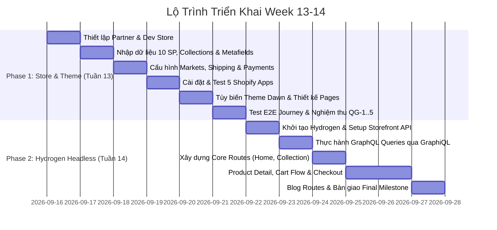

# ROADMAP — LỘ TRÌNH TRIỂN KHAI PHÂN HỆ WEEK 13-14

> **Tài liệu:** Canonical Project Roadmap & Milestone Verification SSOT  
> **Workspace:** `Week13-14`  
> **Thời gian:** 2 Tuần (Tuần 13 & Tuần 14)  
> **Mục tiêu:** Xây dựng hoàn chỉnh Shopify Development Store (Phase 1) và Hydrogen Headless Storefront (Phase 2).  

---

## 1. Tổng Quan Lộ Trình Hai Giai Đoạn

---

## 2. Chi Tiết Các Mốc Triển Khai Nửa Đầu (Phase 1 — Tuần 13)

### Milestone 1.1: Khởi Tạo Hạ Tầng Shopify Partner & Development Store
- **Nhiệm vụ:**
  - Đăng ký tài khoản tại `partners.shopify.com`.
  - Khởi tạo Development Store với mục đích kiểm thử và xây dựng ("Create a store to test and build").
  - Đặt tên store đại diện: `limiphotography-store` (hoặc tên tương đương).
- **Tiêu chuẩn nghiệm thu:** Truy cập mượt mà vào trang quản trị Shopify Admin (`https://admin.shopify.com/store/{store-name}`).

### Milestone 1.2: Xây Dựng Dữ Liệu Catalog Thực Tế, Metafields & Metaobjects
- **Nhiệm vụ:**
  - Tạo 3 Collections: *Cameras & Optics*, *Lighting & Audio*, *Rigging & Accessories*.
  - Thêm 10 sản phẩm điện ảnh & nhiếp ảnh hoàn chỉnh: Hình ảnh HD thiết bị, mô tả chuyên sâu, phân loại Vendor, Type, Tags.
  - Cấu hình Options & Variants: Mount (`Sony E`, `Canon RF`, `Nikon Z`), Kit Options (`Standard`, `Pro Combo`), Color (`Stealth Black`, `Classic Silver`), SKU logic, Compare-at price.
  - Định nghĩa 3 Custom Metafields tại `Settings > Metafields and metaobjects > Products`:
    1. `custom.technical_specifications` (`multi_line_text_field`).
    2. `custom.package_contents` (`multi_line_text_field`).
    3. `custom.compatibility` (`single_line_text_field`).
  - Định nghĩa Metaobject `gear_warranty_plan` (Gói bảo hành thiết bị) và liên kết với sản phẩm.
  - Điền dữ liệu metafields kỹ thuật thực tế cho từng sản phẩm.
  - Viết 3 bài blog chuyên môn chuẩn SEO trong blog "News".
  - Tạo 4 trang tĩnh & chính sách: *About Us*, *Contact Us*, *Warranty & Service Policy*, *Shipping & Transit Insurance Policy*, *Privacy Policy*.
- **Tiêu chuẩn nghiệm thu:** Đạt chuẩn **Quality Gate QG-1 (Store Data & Catalog Audit)**.

### Milestone 1.3: Cấu Hình Vận Hành Toàn Cầu, Thị Trường & Thanh Toán
- **Nhiệm vụ:**
  - Thiết lập **Shopify Markets**: Thị trường nội địa (Vietnam - VND) và Thị trường quốc tế (United States - USD).
  - Bật tính năng chuyển đổi đa tiền tệ (Multi-currency) và quy tắc làm tròn giá `.99`.
  - Thiết lập **Shipping Profiles**: Bảng cước vận chuyển nội địa (Free ship đơn > 500k VND, standard 30k VND) và quốc tế ($15 USD flat rate).
  - Cấu hình Thuế (Taxes) và Kích hoạt **Bogus Test Payment Gateway** (hoặc Shopify Payments Test mode).
  - Bật Customer Accounts (New Customer Accounts hoặc Classic).
- **Tiêu chuẩn nghiệm thu:** Đạt chuẩn **Quality Gate QG-2 (Store Operations & Markets Audit)**.

### Milestone 1.4: Cài Đặt & Kiểm Thử 5 Shopify Apps Thiết Yếu
- **Nhiệm vụ:**
  - Cài **Shopify Search & Discovery**: Tùy biến bộ lọc (Filters theo Size, Color, Price, Availability, Metafield), cấu hình Product Recommendations.
  - Cài **Shopify Translate & Adapt**: Cấu hình bản dịch đa ngôn ngữ cho thị trường quốc tế.
  - Cài **Shopify Inbox**: Kích hoạt App Embed live chat, thiết lập tin nhắn chào mừng tự động.
  - Cài **Judge.me Product Reviews**: Cấu hình hiển thị đánh giá sao và review widget.
  - Cài **Klaviyo**: Tìm hiểu flow tạo tài khoản và cấu hình token/form đăng ký newsletter.
- **Tiêu chuẩn nghiệm thu:** Đạt chuẩn **Quality Gate QG-3 (Apps & Theme Extensions Audit)**.

### Milestone 1.5: Tùy Biến Theme Dawn & Xây Dựng Bản Sắc Thương Hiệu
- **Nhiệm vụ:**
  - Cài đặt Theme **Dawn** (bản chuẩn Online Store 2.0 mới nhất).
  - Tùy biến Theme Settings: Upload Brand Logo và Favicon sắc nét, phối bảng màu trang nhã, chọn typography đồng bộ.
  - Bật các App Embeds tương ứng (Shopify Inbox, Judge.me).
- **Tiêu chuẩn nghiệm thu:** Đạt chuẩn **Quality Gate QG-4 (Theme Customizer & Layout Audit)**.

### Milestone 1.6: Thiết Kế Toàn Bộ Các Trang Bằng Theme Customizer
- **Nhiệm vụ:**
  - **Homepage:** Announcement bar, Header navigation lồng nhau, Hero Banner với CTA, Featured Collection grid, Collection List, Brand Story, Testimonials, Newsletter.
  - **Collection Template:** Bộ lọc dọc (Vertical filter), bộ sắp xếp giá/ngày, lưới sản phẩm responsive.
  - **Product Template:** Gallery ảnh trực quan, Variant picker, Buy buttons, Accordion collapsibles liên kết với Metafields (`custom.technical_specifications`, `custom.package_contents`, `custom.compatibility`), Judge.me widget, Related products.
  - **Blog & Article Template:** Bố cục bài viết thông thoáng, bài viết liên quan.
  - **Footer:** Policies links, Newsletter form, Social media links.
- **Tiêu chuẩn nghiệm thu:** Toàn bộ các trang hiển thị mượt mà, đầy đủ thông tin, không gãy vỡ layout trên cả Desktop và Mobile.

### Milestone 1.7: Kiểm Thử Toàn Diện Luồng Khách Hàng (Customer Journey E2E)
- **Nhiệm vụ:**
  - Thực hiện kiểm thử trọn vẹn luồng mua hàng: Duyệt sản phẩm $\to$ Lọc $\to$ Chọn Mount/Kit $\to$ Thêm giỏ hàng $\to$ Điền form thanh toán $\to$ Dùng thẻ test Bogus Gateway đặt hàng thành công.
  - Kiểm tra đơn hàng mới xuất hiện với trạng thái `Paid` trong Shopify Admin.
  - Thử nghiệm chức năng Fulfillment đơn hàng.
- **Tiêu chuẩn nghiệm thu:** Đạt chuẩn **Quality Gate QG-5 (E2E Customer Journey Audit)**. Bàn giao Phase 1.

---

## 3. Chi Tiết Các Mốc Triển Khai Nửa Sau (Phase 2 — Hydrogen Headless Storefront)

> **Nguyên tắc trọng tâm Phase 2:**
> Trong tuần này, không cần dành thời gian cho CSS đẹp. Mục tiêu là hiểu Hydrogen routing, loaders, Shopify data, GraphQL, cart, và checkout flow. Markup đơn giản, dễ đọc là đủ. Phần styling polish sẽ làm ở final project.

### Milestone 2.1: Khởi Tạo Dự Án Hydrogen & Kết Nối Storefront API
- **Nhiệm vụ:**
  - Chạy lệnh khởi tạo: `npm create @shopify/hydrogen@latest` (chọn TypeScript, Tailwind CSS).
  - Tạo Custom App trong Shopify Admin và trích xuất Public Storefront API Access Token với đầy đủ quyền (`unauthenticated_read_product_listings`, `unauthenticated_read_content`, `unauthenticated_write_checkouts`...).
  - Thiết lập tệp `.env`: `SESSION_SECRET`, `PUBLIC_STORE_DOMAIN`, `PUBLIC_STOREFRONT_API_TOKEN`, `PUBLIC_STOREFRONT_API_VERSION`.
  - Chạy local dev server `npm run dev` tại `http://localhost:3000` và xác nhận app query được dữ liệu thật từ store.
- **Tiêu chuẩn nghiệm thu:** Đạt chuẩn **Quality Gate QG-6 (Hydrogen Setup & Storefront API Connectivity)**.

### Milestone 2.2: Làm Chủ GraphQL Storefront API Qua Shopify GraphiQL App
- **Nhiệm vụ:**
  - Cài đặt và đăng nhập [Shopify GraphiQL App](https://shopify-graphiql-app.shopifycloud.com/login) kết nối với `limiphotography-store.myshopify.com`.
  - Hoàn thành và kiểm chứng 100% bộ 7 bài tập truy vấn:
    1. Query thông tin shop (`name`, `description`, `primaryDomain`, `paymentSettings`).
    2. Lấy 10 sản phẩm đầu tiên với `title`, `handle`, `priceRange`, `images`, `variants`.
    3. Lấy một collection theo `$handle` kèm danh sách products.
    4. Query product variants, `selectedOptions`, và tình trạng `availableForSale`.
    5. Lấy danh sách blog articles với `authorV2` và `publishedAt`.
    6. Query 3 Custom Metafields từ products (`technical_specifications`, `package_contents`, `compatibility`).
    7. Thực hành phân trang dựa trên con trỏ (**cursor-based pagination** với `first`, `after`, `pageInfo.hasNextPage`).
- **Tiêu chuẩn nghiệm thu:** Đạt chuẩn **Quality Gate QG-7 (GraphQL Storefront API Mastery)**.

### Milestone 2.3: Xây Dựng 5 Routes Hydrogen Cốt Lõi (Zero CSS Bloat)
- **Nhiệm vụ:**
  - **Homepage (`_index.tsx`):** Nạp dữ liệu từ Storefront API hiển thị shop info, featured collections và trending products.
  - **Collection Page (`collections.$handle.tsx`):** Render danh sách sản phẩm theo collection handle, hỗ trợ nút phân trang cursor (Next Page).
  - **Product Page (`products.$handle.tsx`):** Thư viện ảnh, variant picker chọn Mount/Kit/Color, cập nhật giá theo biến thể, hiển thị bảng 3 Metafields kỹ thuật và form Add to Cart.
  - **Blog Article Page (`blogs.$blogHandle.$articleHandle.tsx`):** Render chi tiết bài viết chuẩn SEO, tác giả, ngày đăng và nội dung HTML.
  - **Quy tắc UI tối giản:** Sử dụng HTML ngữ nghĩa chuẩn, layout Flex/Grid cơ bản của Tailwind, không tốn thời gian cho hiệu ứng hoặc animation phức tạp.
- **Tiêu chuẩn nghiệm thu:** Đạt chuẩn **Quality Gate QG-8 (Hydrogen Core Routes & Data Binding)**.

### Milestone 2.4: Hoàn Thiện Headless Cart Flow & Chuyển Hướng Shopify Checkout
- **Nhiệm vụ:**
  - Xây dựng route `app/routes/cart.tsx` với Remix Action xử lý các mutations: `cartCreate`, `cartLinesAdd`, `cartLinesUpdate`, `cartLinesRemove`.
  - Quản lý `cartId` an toàn trong encrypted Session Cookie (HttpOnly).
  - Triển khai nút "Proceed to Checkout" thực hiện chuyển hướng trình duyệt (302 redirect) sang URL `checkoutUrl` của Shopify Hosted Checkout.
  - Thực hiện đặt hàng thành công bằng thẻ test Bogus Gateway (số `1`), kiểm tra đơn hàng mới hiển thị `Paid` trong Shopify Admin.
- **Tiêu chuẩn nghiệm thu:** ✅ Đã hoàn thành — Đạt chuẩn **Quality Gate QG-9 (Headless Cart Flow & Checkout Redirect)**.

### Milestone 2.5: Kiểm Định Toàn Diện Mã Nguồn & Nghiệm Thu Chất Lượng
- **Nhiệm vụ:**
  - Chạy kiểm tra kiểu dữ liệu: `npm run typecheck` đạt 0 errors (TypeScript Strict, không dùng `any`).
  - Chạy kiểm tra quy chuẩn: `npm run lint` đạt 0 errors.
  - Thực hiện build production: `npm run build` thành công, không gặp lỗi SSR hay hydration mismatch.
  - Bổ sung Empty State cơ khí (`PaginatedResourceSection.tsx`) và Hardware Diagnostics (`root.tsx`).
  - Đối chiếu và nghiệm thu toàn bộ 5 Cổng kiểm định chất lượng (QG-6 $\to$ QG-10). Hoàn tất bàn giao Phase 2.
- **Tiêu chuẩn nghiệm thu:** ✅ Đã hoàn thành — Đạt chuẩn **Quality Gate QG-10 (Strict Code Quality & Build Verification)**.

### Milestone 2.6: Tái Cấu Trúc Toàn Diện Kiến Trúc Thị Trường & Ngôn Ngữ (SOLID Localization)
- **Nhiệm vụ:**
  - **Core Registry & Dynamic Routing:** Tự động hóa sinh route cho $N$ thị trường trong `app/routes.ts` dựa trên SSOT `SUPPORTED_LOCALES`.
  - **Triệt tiêu if-else:** Chuyển đổi toàn bộ component sang `useTranslation()`, tách từ điển `app/locales/{vi,en}.ts` tuân thủ `TranslationSchema` (Strategy & Open/Closed Principle).
  - **Xóa bỏ Leaky Links:** Chuẩn hóa 100% các liên kết nội bộ qua `~/components/Link` và `useNavigateLocale()` tại 14+ tệp, bảo toàn tiền tố locale tuyệt đối.
  - **Đồng bộ đa tiền tệ giỏ hàng:** Auto-sync `buyerIdentity.countryCode` trên server background, bảo đảm checkout khớp currency.
  - **SEO & Canonical:** Cung cấp thẻ `<link rel="alternate" hreflang="...">` cho từng thị trường.
- **Tiêu chuẩn nghiệm thu:** ✅ Đã hoàn thành — Đạt chuẩn **Quality Gate QG-11 (SOLID Localization & Zero Leaky Links)** (TypeScript strict 0 errors, ESLint 0 errors, Build 100% pass, SSR verified).

---

## 4. Bảng Đối Soát 6 Tiêu Chí Cốt Lõi Dự Án (Mandatory Criteria Compliance Matrix)

| STT | Tiêu Chí Bắt Buộc | Tệp Triển Khai / Bằng Chứng Kỹ Thuật | Trạng Thái |
| :---: | :--- | :--- | :---: |
| **1** | **Khởi tạo Hydrogen app, cấu hình env & kết nối đúng dev store** | `app/server.ts`, `.env`, `.env.example` Kết nối store: `intern-ha-duc-duong-store.myshopify.com` | ✅ **HOÀN TẤT** |
| **2** | **Storefront API queries (Shop, Products, Collections, Variants, Articles, Metafields)** | `products.$handle.tsx`, `collections.$handle.tsx`, `blogs.$blogHandle.$articleHandle.tsx`, `_index.tsx` 3 custom metafields: `technical_specifications`, `package_contents`, `compatibility` | ✅ **HOÀN TẤT** |
| **3** | **Đầy đủ routes (Homepage, Collection handle, Product handle, Blog/Article)** | `_index.tsx`, `collections.$handle.tsx`, `products.$handle.tsx`, `blogs.$blogHandle.$articleHandle.tsx`, `cart.tsx` | ✅ **HOÀN TẤT** |
| **4** | **Product page xử lý selected options, availability, URL & Null safety** | `products.$handle.tsx`, `ProductForm.tsx`, `ProductPrice.tsx`, `ProductImage.tsx` `useSelectedOptionInUrlParam`, `availableForSale` fallback, `?.` null safety 100% | ✅ **HOÀN TẤT** |
| **5** | **Cart mutations (Add, Update, Remove), Redirect Checkout & Session persistence** | `cart.tsx`, `CartSummary.tsx`, `CartLineItem.tsx`, `AddToCartButton.tsx` `AppSession` HttpOnly encrypted cookie, 302 redirect sang `checkoutUrl` | ✅ **HOÀN TẤT** |
| **6** | **Pagination, Loading/Error/Empty states, Tài liệu setup & Deploy chạy được** | `PaginatedResourceSection.tsx`, `root.tsx` ErrorBoundary, `dev-setup.md`, `oxygen-deployment.md` `npm run build` pass 100%, Oxygen linked | ✅ **HOÀN TẤT** |

