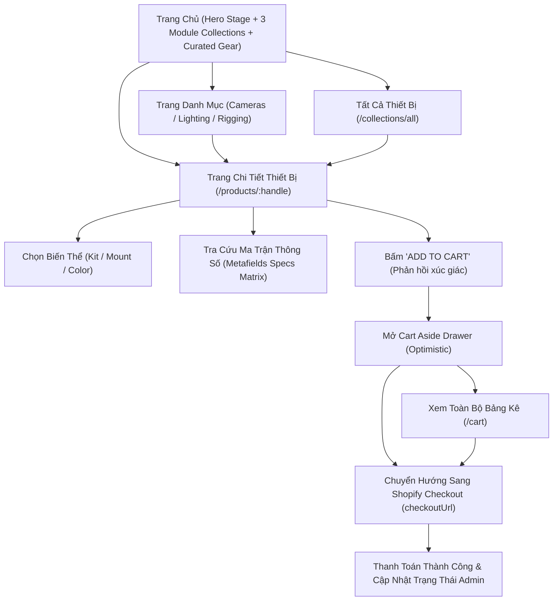

# UI Design Spec — Limi Photography Hardware Headless Storefront

> Tài liệu đặc tả giao diện & trải nghiệm người dùng toàn diện (UI/UX SRS Specification)  
> Scope: Thiết kế và hoàn thiện hệ thống giao diện storefront (Hydrogen v2026.4.x, React Router v7, Tailwind CSS v4).  
> **Triết lý cốt lõi:** Hiện thực hóa phong cách **Tactile Neo-Industrial (Dieter Rams & Bauhaus Functionalism)** — giao diện như một bàn điều khiển cơ khí chính xác, mạch lạc, trung thực với vật liệu, tương phản cao, phản hồi xúc giác dứt khoát và tối ưu hóa cho giao dịch thiết bị quang học cao cấp.

---

## 1. Định Vị Sản Phẩm & Bộ Tiêu Chí Đo Lường Thành Công (Success Criteria)

Storefront phục vụ đối tượng khách hàng là nhà làm phim độc lập, đạo diễn hình ảnh, nhiếp ảnh gia thương mại và chuyên viên kỹ thuật trường quay.

| Mã | Tiêu chí đo lường | Chỉ tiêu chất lượng (Target) | Phương pháp kiểm chứng |
| :---: | :--- | :--- | :--- |
| **S1** | **Thời gian tải trang ban đầu (TTFB / FCP)** | FCP ≤ 0.8s, LCP ≤ 1.5s trên mạng 4G/Wifi | Đo đạc Lighthouse & Chrome DevTools |
| **S2** | **Độ trễ chuyển đổi biến thể (Variant Switch)** | ≤ 50ms (Optimistic UI không giật lag) | `useOptimisticVariant` & search params |
| **S3** | **Độ rõ nét ma trận thông số (Specs Readability)** | 100% thông số camera/lens có thể đọc lướt trong 3 giây | Bảng Specs Matrix phân ô chuẩn `tabular-nums` |
| **S4** | **Phản hồi xúc giác Thêm giỏ hàng (Tactile Feedback)** | Phản hồi lún phím tức thì kèm mở Aside Drawer mượt mà | Visual press state & Cart Aside animation |
| **S5** | **Độ sâu điều hướng (Navigation Depth)** | Mọi sản phẩm đến được trong ≤ 2 cú nhấp chuột | Header megamenu & Module Featured Collections |
| **S6** | **Tương phản công thái học (Contrast Ratio)** | Tối thiểu ≥ 4.5:1 với văn bản thường, ≥ 7:1 cho tiêu đề | WCAG 2.1 AA Compliance trên nền nhôm xám |
| **S7** | **Tỷ lệ chuyển đổi Checkout (Zero-Friction Handoff)** | 1-click chuyển hướng an toàn sang Shopify Hosted Checkout | Nút "PROCEED TO CHECKOUT" với `checkoutUrl` |
| **S8** | **Không lỗi dịch chuyển bố cục (CLS)** | CLS = 0 (Ảnh dùng aspect-ratio và sizing chuẩn) | Skeleton & Hydrogen `<Image>` component |

---

## 2. Đặc Tả Chi Tiết Các Màn Hình Chính (Key Screens & Form)

### 2.1. Navigation & Global Shell (`PageLayout.tsx`, `Header.tsx`, `Footer.tsx`)
- **Header Console:**
  - Cố định trên cùng (Sticky Top), chiều cao `64px` (`h-16`).
  - Nền trắng cơ khí `#FFFFFF`, viền đáy 1px `#D1D5DB`.
  - Logo thương hiệu **LIMI PHOTOGRAPHY** bằng kiểu chữ hình học đậm nét, đi kèm khối vuông Cam Shutter kích thước 6px.
  - Menu ngang: *Cameras & Optics*, *Lighting & Audio*, *Rigging & Accessories*, *All Hardware*, *Journal* (màu `#4B5563` hover `#111827`).
  - Cụm điều khiển bên phải: Ô tìm kiếm nhanh với phím tắt gợi ý, Nút Account, và Nút Giỏ Hàng có badge đếm số lượng màu Cam Shutter dạng tem dập nổi.
- **Footer Console:**
  - Nền xám nhôm gia công `#E9ECEF` kết hợp viền trên `#D1D5DB`.
  - Bố cục lưới 4 cột phân vùng công nghiệp: Giới thiệu thương hiệu & Triết lý phần cứng, Danh mục thiết bị, Chính sách kiểm định & bảo hành 24 tháng, Bản tin cập nhật firmware & công nghệ quang học.

### 2.2. Màn Hình Trang Chủ (`_index.tsx`) — Ưu Tiên 1
- **Hero Hardware Showcase:**
  - Nhãn định danh module: `● HARDWARE ECOSYSTEM // OPTICAL BENCHMARK` viền cơ khí dứt khoát.
  - Tiêu đề H1: *Precision Optical & Cinema Hardware for Visual Architects* màu đen mực kỹ thuật `#111827`.
  - Khối thông số kỹ thuật dạng ma trận 4 ô (Specs Grid) tích hợp sẵn: `4K 120P RAW` · `15+ STOPS DR` · `DUAL BASE ISO` · `ACTIVE COOLING`.
  - Cụm nút CTA công nghiệp:
    - Nút Primary: Màu Cam Shutter `#EA580C`, viền `#C2410C`, có hiệu ứng lún phím cơ học 1px khi nhấn (`active:translate-x-[1px] active:translate-y-[1px] active:shadow-none`).
    - Nút Secondary: Nền trắng `#FFFFFF`, viền thép `#D1D5DB`, hover đổi nền xám nhôm `#E9ECEF`.
  - Thanh Value Proposition: 4 khối cam kết thiết bị (Chính hãng 100%, Bảo hành 24 tháng, Vận chuyển an toàn chống sốc, Hỗ trợ kỹ thuật 24/7).
- **Featured Collections Showcase:**
  - Lưới 3 module danh mục tỉ lệ 16:9:
    1. *Cameras & Optics* (`MOD-01`)
    2. *Lighting & Audio* (`MOD-02`)
    3. *Rigging & Accessories* (`MOD-03`)
  - Viền cơ khí 1px bao quanh từng module, nhãn tên in hoa sắc nét.
- **Curated Hardware Grid (Recommended Gear):**
  - Lưới sản phẩm 3 cột (Desktop) / 2 cột (Tablet) / 1 cột (Mobile).
  - Thẻ card chassis trắng `#FFFFFF`, viền `#D1D5DB`, đổ bóng cứng dập nổi khi hover `shadow-[3px_3px_0px_#CBD5E1]`.

### 2.3. Màn Hình Danh Mục Sản Phẩm (`collections.$handle.tsx` & `collections.all.tsx`) — Ưu Tiên 2
- **Collection Header Console:**
  - Banner nền trắng `#FFFFFF` viền `#D1D5DB`.
  - Breadcrumb: `Hardware > Collections > [Collection Title]` màu xám `#6B7280`.
  - Tiêu đề danh mục H1 đậm chất kỹ thuật, mô tả định vị trang thiết bị.
- **Product Grid & Pagination Controls:**
  - Lưới sản phẩm responsive `grid-cols-1 sm:grid-cols-2 lg:grid-cols-3 gap-6`.
  - Thanh điều khiển phân trang: Các nút "LOAD PREVIOUS UNITS" và "LOAD NEXT UNITS" thiết kế dạng phím bấm cơ khí viền `#D1D5DB` với phản hồi xúc giác khi bấm.

### 2.4. Màn Hình Chi Tiết Sản Phẩm (`products.$handle.tsx`) — Ưu Tiên 3
- **Bố cục 2 cột công thái học (Desktop) / 1 cột (Mobile):**
  - **Cột Trái (Media Showcase - 7 cột):**
    - Khung ảnh chính 1:1 đặt trên nền nhôm gia công `#F1F3F5` có viền `#D1D5DB`.
    - Dải thumbnails nhiều góc cạnh có viền active dứt khoát.
    - Khối mô tả sản phẩm và Bảng thông số kỹ thuật Metafields.
  - **Cột Phải (Purchase & Specs Console - 5 cột, Sticky):**
    - Tem thương hiệu Vendor (`SONY`, `SIGMA`, `DJI`) in hoa trong khung tem kim loại.
    - Tiêu đề sản phẩm H1 màu đen mực kỹ thuật `#111827`.
    - Mã SKU linh hoạt theo từng biến thể.
    - Dải giá bán với định dạng số đếm chuẩn, giá so sánh gạch ngang và nhãn ưu đãi.
    - **Variant Selector:** Cụm phím chọn Option biến thể cơ khí, khi active có viền `#EA580C` và nền cam nhạt `#FFF7ED`.
    - **Nút "ADD TO CART":** Nút lớn màu Cam Shutter toàn chiều rộng, tự động chuyển sang "SOLD OUT" khi hết hàng.
    - **Bảng Ma Trận Thông Số Kỹ Thuật (Hardware Specs Matrix):** Hiển thị 3 Metafields kỹ thuật:
      1. *Hardware Specs* (`custom.technical_specifications`)
      2. *In The Box* (`custom.package_contents`)
      3. *Ecosystem Compatibility* (`custom.compatibility`)

### 2.5. Giỏ Hàng & Khung Điều Khiển (`cart.tsx` & Aside Drawer)
- Hỗ trợ cả 2 chế độ: **Aside Drawer trượt ngang** và **Trang giỏ hàng độc lập** (`/cart`).
- Khung Drawer nền trắng `#FFFFFF`, viền trái cơ khí `#D1D5DB`, đổ bóng cứng dập khối.
- Từng dòng sản phẩm hiển thị ảnh thu nhỏ, tên biến thể, đơn giá, cụm tăng giảm số lượng gồm 3 nút vật lý `[-] [Qty] [+]` và nút gỡ bỏ "Remove".
- Khung tóm tắt chi phí (Subtotal, Tax, Shipping) nền xám `#F1F3F5` viền `#D1D5DB`.
- Nút **"PROCEED TO CHECKOUT"** màu Cam Shutter kích thước lớn, chuyển hướng trực tiếp sang Shopify Hosted Checkout.

---

## 3. Bản Đồ Kiến Trúc Thông Tin & Hành Trình Mua Hàng (IA & Flow)



---

## 4. Hệ Thống Design Tokens (Tailwind CSS v4 `@theme`)

Toàn bộ thông số được cấu hình trong `app/styles/tailwind.css`:

```css
@import 'tailwindcss';

@theme {
  /* Industrial Palette */
  --color-canvas: #F1F3F5;
  --color-plate: #E9ECEF;
  --color-surface: #FFFFFF;
  --color-border: #D1D5DB;
  --color-border-strong: #9CA3AF;
  
  --color-text-main: #111827;
  --color-text-muted: #4B5563;
  --color-text-subtle: #6B7280;

  --color-shutter: #EA580C;
  --color-shutter-hover: #C2410C;
  --color-shutter-light: #FFF7ED;

  --color-optical-teal: #0D9488;
  --color-signal-green: #16A34A;

  /* Typography */
  --font-display: 'Space Grotesk', system-ui, -apple-system, sans-serif;
  --font-body: 'Geist', 'Inter', system-ui, -apple-system, sans-serif;

  /* Crisp Industrial Radii */
  --radius-xs: 2px;
  --radius-sm: 4px;
  --radius-md: 6px;
}
```

---

## 5. Nguyên Tắc Tương Tác Xúc Giác & Động Lực Học (Tactile Motion & Interaction)

1. **Hiệu ứng Nhấn Cơ Học (Tactile Depressed State):**
   - Mọi nút bấm tương tác chính (`button`, `a.btn`) áp dụng quy tắc:
     - `active:translate-x-[1px] active:translate-y-[1px]`
     - `active:shadow-none`
   - Tạo cảm giác ấn phím vật lý dứt khoát, loại bỏ độ trễ ảo.
2. **Thời gian chuyển động (Duration & Easing):**
   - Chuyển đổi viền và màu sắc: `duration-150 ease-out`.
   - Trượt mở Drawer: `duration-300 ease-[cubic-bezier(0.16,1,0.3,1)]`.
   - Tuyệt đối không dùng chuyển động nhún nảy lố lăng làm mất tính chuyên nghiệp của thiết bị kỹ thuật.

---

## 6. Tiêu Chuẩn Tiếp Cận & Khả Năng Đọc (Accessibility & Ergonomics)

- **Độ tương phản màu sắc (WCAG 2.1 AA):**
  - Chữ chính `#111827` trên nền `#FFFFFF` đạt tỷ lệ tương phản **16.5:1** (vượt chuẩn AAA).
  - Chữ chính `#111827` trên nền xám `#F1F3F5` đạt tỷ lệ tương phản **14.2:1** (vượt chuẩn AAA).
  - Chữ phụ `#4B5563` trên nền `#FFFFFF` đạt tỷ lệ tương phản **7.3:1** (đạt chuẩn AAA).
  - Nút Cam Shutter `#EA580C` với chữ trắng đạt tỷ lệ tương phản **4.6:1** (đạt chuẩn AA cho UI components).
- **Trạng thái Focus bàn phím (Keyboard Focus Ring):**
  - Mọi phần tử có thể focus được bảo vệ bằng viền đôi cơ khí: `focus-visible:outline-none focus-visible:ring-2 focus-visible:ring-[#EA580C] focus-visible:ring-offset-2`.
